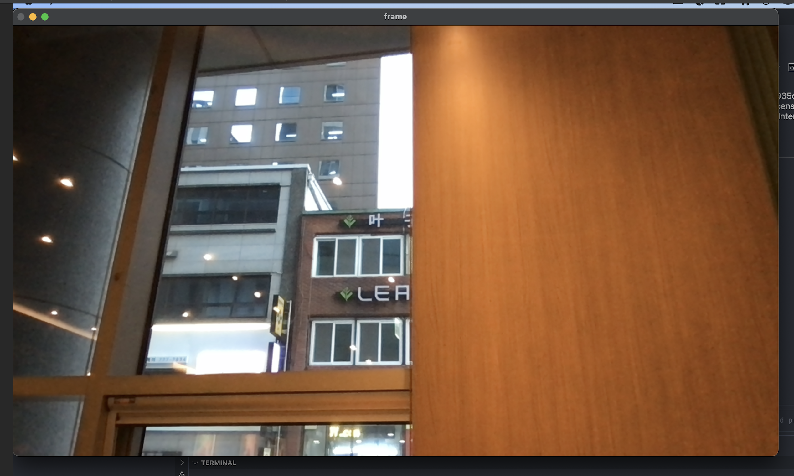
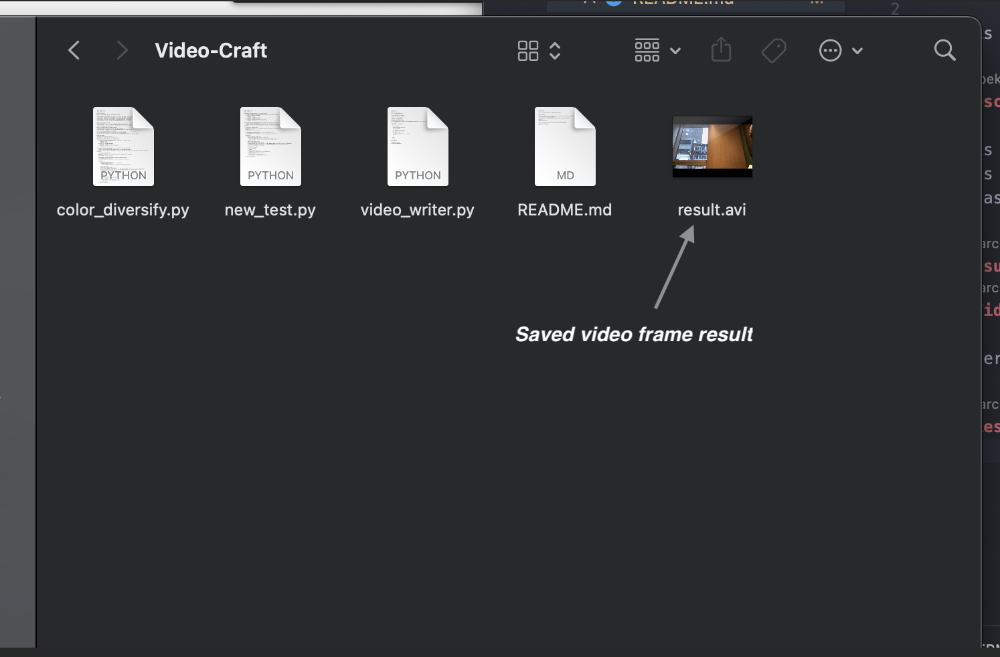

# Video-Craft

- This is a Open CV practice implementation space.

## Description

- This is a small application that takes the input from the front camera and reads it and writes it to the frame. Fiinally it saves the written frame as "result.avi"
  Please refer to the below link to learn how to run this application.

## Results

### Video Simulation

- Refer to this link [Simulation](https://youtube.com)

### Result Screenshots

 

